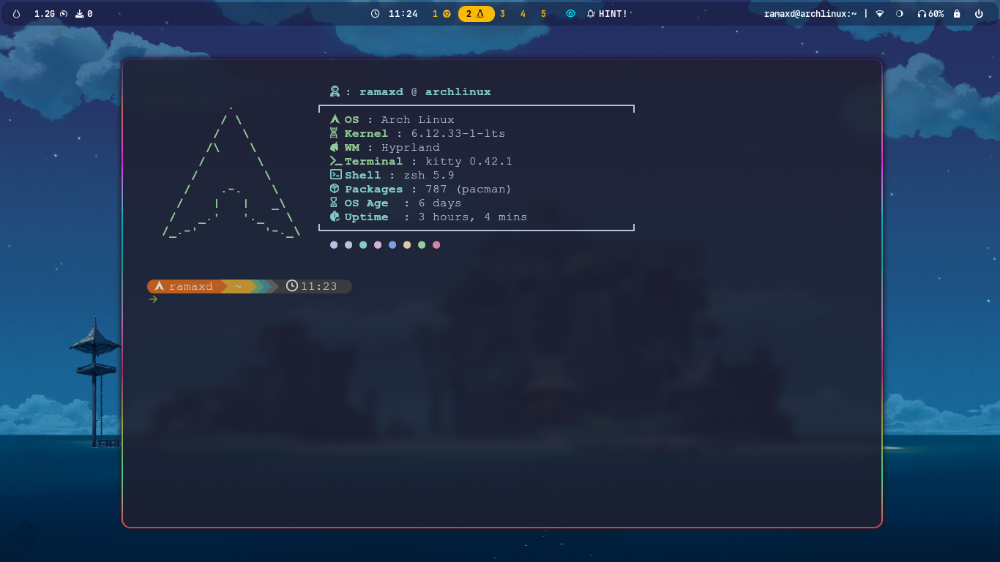
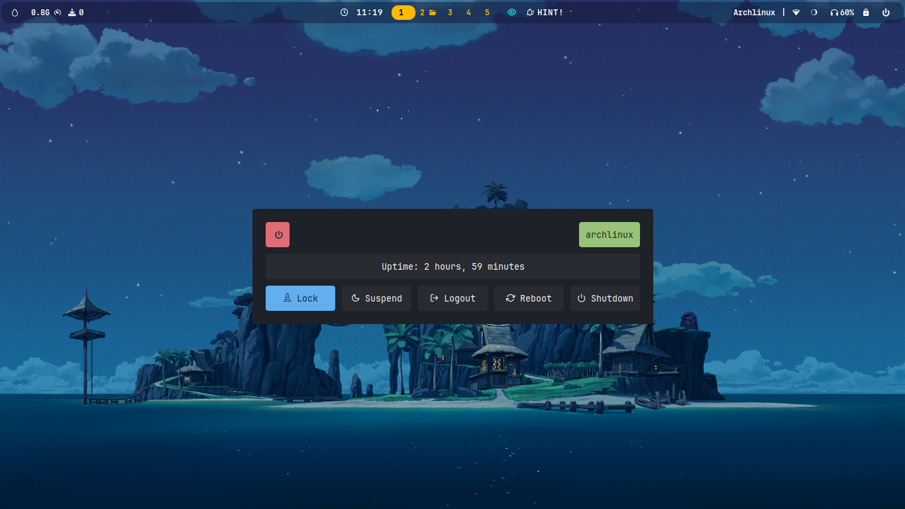
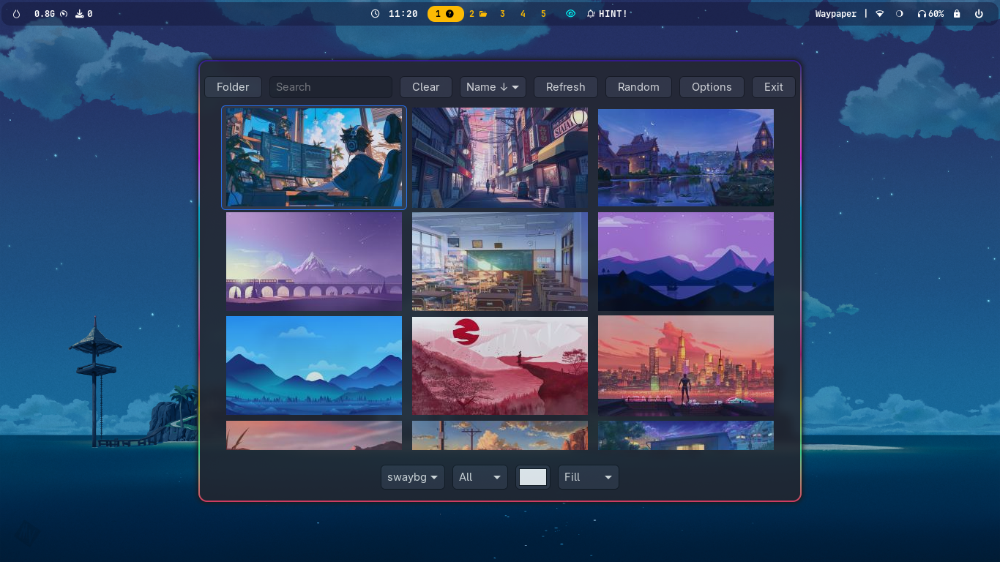

# KISS hyprland configuration 
Keep in mind that this configuration is not very fancy but it works for my personal needs.

<!-- # 🍚 dotfiles -->

<h4 align="center">A minimalist Hyprland setup built on top of <a href="https://wiki.archlinux.org/title/Installation_guide" target="_blank">Archlinux</a>.</h4>

## Information

* OS - [Arch](https://archlinux.org)
* WM - [Hyprland](https://hyprland.org/)
* Bar: [Waybar](https://github.com/Alexays/Waybar)
* Launcher : [Rofi](https://github.com/davatorium/rofi)
* Terminal: [Kitty](https://github.com/kovidgoyal/kitty)
* Themes manager: [nwg-look](https://github.com/nwg-piotr/nwg-look)
* Lockscreen - [Hyprlock] (https://github.com/hyprwm/hyprlock)
* NetworkManager - $ nmtui
* Screenshoter - [Grim|Slurp|Wl-clipboard]
* Notification - [Dunst] (https://github.com/dunst-project/dunst)
* Wallpaper - [Swaybg] (https://github.com/swaywm/swaybg)
* Wallpaper chooser - [Waypaper] (https://github.com/anufrievroman/waypaper)
* Image Viewer - [Gthumb] (https://archlinux.org/packages/extra/x86_64/gthumb/)
* PDF Viewer - [Zathura|Zathura-mupdf]

